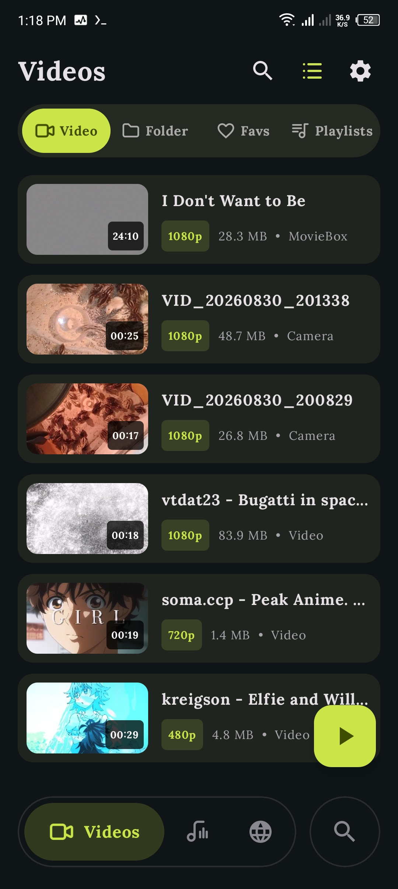
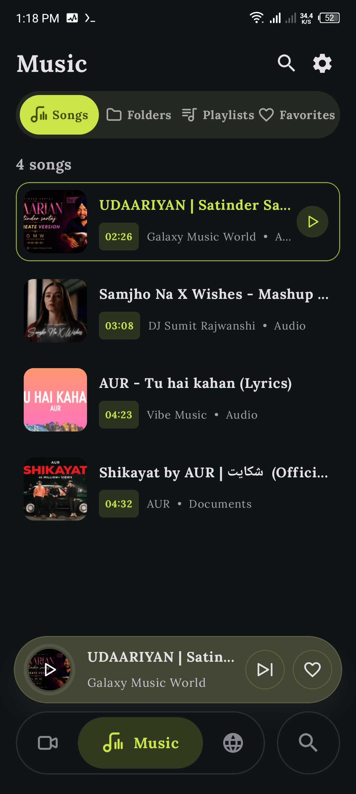
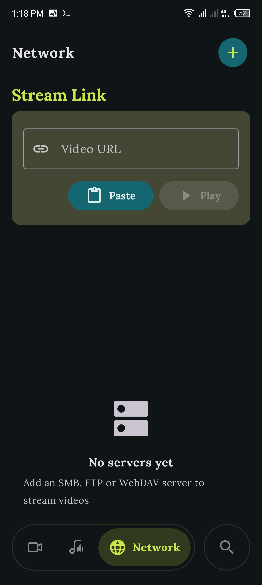
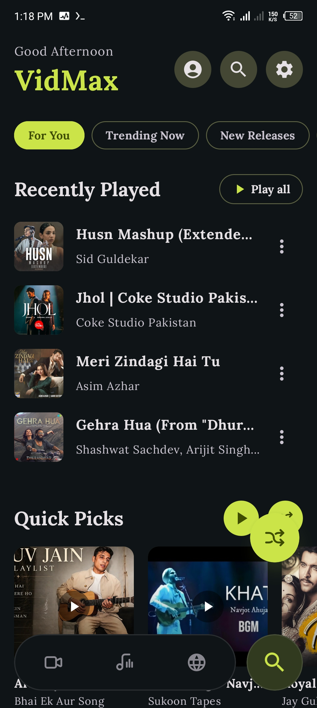
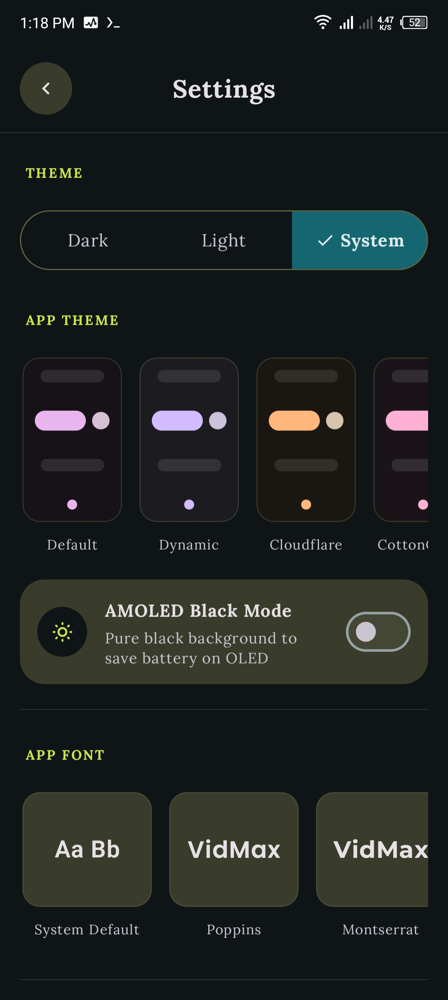
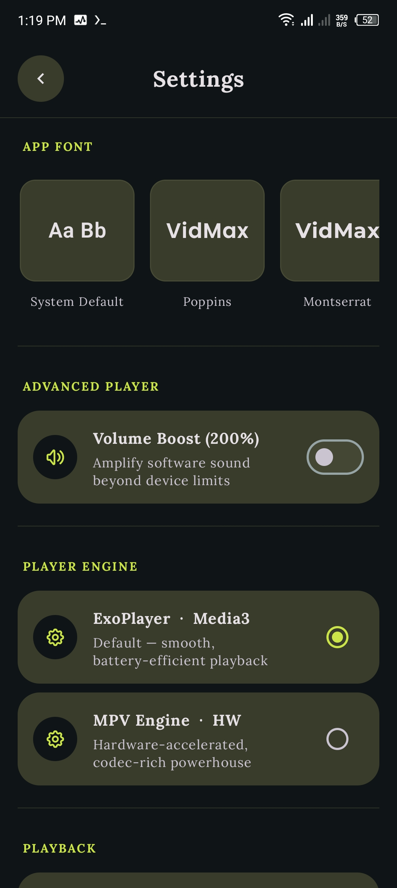
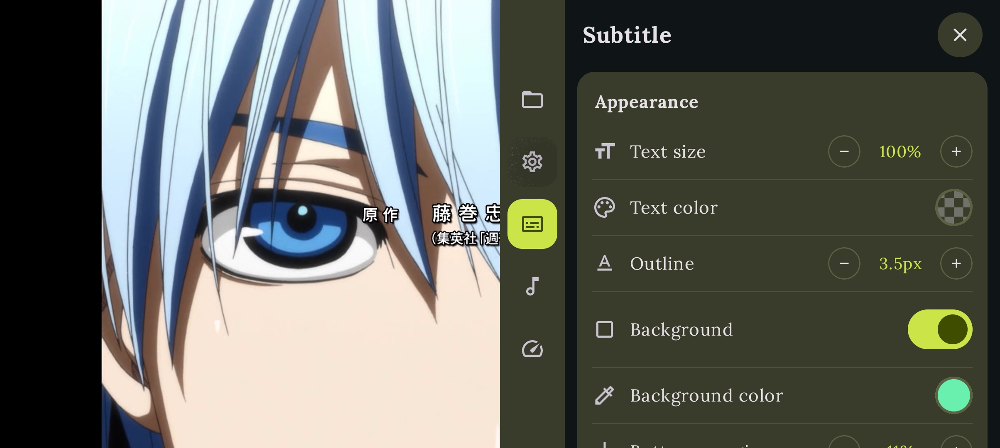
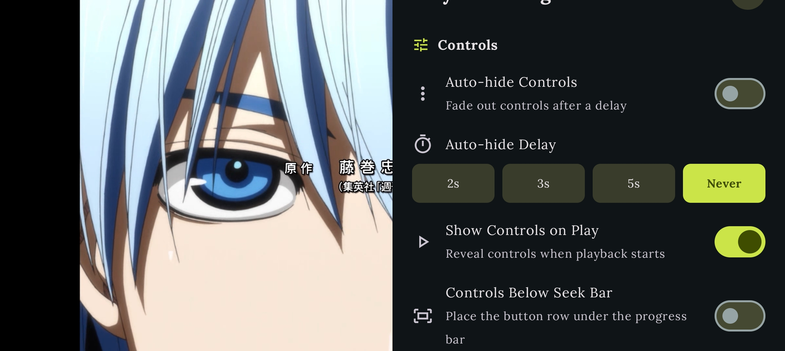
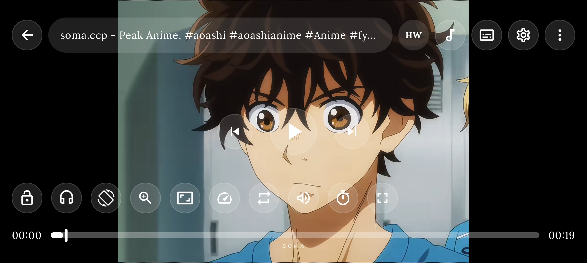

<div align="center">

<br/>


<br/><br/>

[](https://github.com/HATAKE2008/vidamx/actions/workflows/build.yml)
[](./LICENSE)
[](https://developer.android.com/)
[](https://kotlinlang.org/)

[](https://m3.material.io/)
[](#)
[](#-themes)
[](#-network-streaming)
[](#-stream-link)

<br/><br/>

###  A modern, privacy-focused media player for Android

**Local Media · Network Streaming · Online Music · MPV · Media3**

<br/>

<a href="https://github.com/HATAKE2008/vidamx/releases/latest">

</a>

<a href="https://github.com/HATAKE2008/vidamx">

</a>

<br/><br/>

<strong>Latest Release: <a href="https://github.com/HATAKE2008/vidamx/releases/tag/v1.1.5">VidMax v1.1.5</a></strong>

</div>

---

##  What is VidMax?

**VidMax** is a free and open-source Android media player designed to be fast, clean, customizable and privacy-focused.

> **No ads. No tracking. No unnecessary bloat.**

Play local videos and music, connect directly to NAS or remote servers, stream online media, customize the player and choose from **28 fully offline themes**.

VidMax uses **Jetpack Media3 (ExoPlayer)** as its primary playback engine with **MPV** as a secondary engine for broader codec support.

---

##  Screenshots

<div align="center">

<table>
<tr>
<td align="center" width="25%">

<br/><strong>Videos</strong>
</td>
<td align="center" width="25%">

<br/><strong>Music</strong>
</td>
<td align="center" width="25%">

<br/><strong>Network</strong>
</td>
<td align="center" width="25%">

<br/><strong>Home</strong>
</td>
</tr>
<tr>
<td align="center" width="25%">

<br/><strong>Themes</strong>
</td>
<td align="center" width="25%">

<br/><strong>Player Settings</strong>
</td>
<td align="center" width="25%">

<br/><strong>Subtitles</strong>
</td>
<td align="center" width="25%">

<br/><strong>Player</strong>
</td>
</tr>
</table>

<br/>



</div>

---

##  Key Features

| Feature | Description |
|---|---|
|  Local Playback | Video and music playback |
|  Network Streaming | SMB, FTP and WebDAV |
|  Stream Link | HLS, DASH, SmoothStreaming and HTTP |
|  Online Music | Music discovery and streaming |
|  Themes | 28 fully offline themes |
|  Subtitles | SRT support and customization |
|  Volume Boost | Up to 200% |
|  Gestures | Volume, brightness and zoom |
|  Smart Search | Fast local and online search |
|  Playlists | Video and music playlists |
|  Favorites | Local and online favorites |
|  AMOLED | Pure black theme |
|  Font Changer | Built-in fonts + TTF/OTF |
|  Auto Updates | GitHub release checker |
|  Ads | None |
|  Privacy | No unnecessary tracking |

---

##  What's New in v1.1.5

> **Library UX update — smoother browsing, smarter views, one-click screenshot, Telegram community and Settings Backup & Restore.**

- Improved video library navigation and interactions
- Consistent long-press actions (Delete, Share, etc.) across Videos, Folder, Favorites and other video screens
- Improved pull-to-refresh behavior — no extra tap needed after refresh
- Advanced sorting for large libraries: Newest first, Oldest first, Name A-Z, Name Z-A, Largest first, Longest first, with refresh at the bottom of the sort menu
- Unified Grid/List view control — single top-bar icon toggles the current view
- Automatic 2–3 column grid layout adapting to screen width
- Dedicated improved search experience with history (mpvRex-style SearchScreen)
- One-click video screenshot capture from the player 3-dot menu
- Telegram community integration (`vidmax_opensource`) with Join / Not now options
- Settings Backup & Restore (JSON, UTF-8, SAF picker, strict validation)
- General performance, UI and stability improvements

<a href="https://github.com/HATAKE2008/vidamx/releases/tag/v1.1.5">View Full Changelog →</a>

---

##  What's New in v1.1.4

> **Major update — Network Streaming, rebuilt player, improved music experience and extensive UI polish.**

<a href="https://github.com/HATAKE2008/vidamx/releases/tag/v1.1.4">View Full Changelog →</a>

###  Network Streaming

Connect directly to your own media servers.

- **SMB**
- **FTP**
- **WebDAV**
- Browse remote folders
- Play remote videos and music
- Local proxy streaming
- Improved HTTP source handling
- Fixed SMB/WebDAV/FTP playback
- Fixed duplicated recent links
- Improved server scanning
- Responsive Add Server dialog

Remote files can be played through VidMax without requiring a separate file-transfer application.

---

###  Stream Link

Paste a stream URL and play it directly.

Supported formats:

```text
HTTP
HLS
DASH
SmoothStreaming
```

---

###  Rebuilt Video Player

- MPVEx-style player controls
- Redesigned Settings sheet
- Controls / Aesthetics / Gestures / Advanced categories
- Subtitle and Audio track panels
- ExoPlayer subtitle and audio track selection
- Smooth pinch zoom
- EMA smoothing
- Zoom dead zone
- Volume gestures
- Brightness gestures
- Zoom gestures
- Up to 200% volume boost
- Percent-based volume indicator
- Landscape right-side settings panel
- Live video preview in landscape
- Portrait settings overlay
- Improved aspect-ratio handling
- Centered video after rotation

---

###  Library

- Video playlists
- Video favorites
- New Library ViewModel
- Playlist details
- Glide Compose thumbnails
- Improved FAB positioning
- Detail screen polish

---

###  Home & Music

- Animated home feed
- Daily discovery
- Mood playlists
- Favorites
- Artist discovery
- Song-only filtering
- Expandable search
- Auto-focus search
- HQ thumbnails
- Online favorites
- Unified online/offline music player
- ExoPlayer streaming playback
- Animated navigation
- Video/Folder segmented toggle

---

###  App & CI

- In-app GitHub update checker
- Built-in font collection
- TTF/OTF importer
- Animated splash screen
- Fixed launch black screen
- R8 optimization
- Resource shrinking
- Reduced APK size
- Automated release workflow
- Automatic build, signing and publishing

---

##  Online Music Streaming

VidMax includes an online music discovery and streaming experience without requiring an account.

**Home Feed**

| Section | Description |
|---|---|
| Quick Picks | Personalized-style quick suggestions |
| Daily Discover | Discover new music |
| Keep Listening | Continue listening |
| Forgotten Favorites | Rediscover previous favorites |
| Mood Playlists | Curated mood-based collections |
| Favorites | Saved online tracks |

**Discovery**

- Artist discovery
- Song-only filtering
- Smart search
- Expandable search bar
- Auto-focus search
- Auto-next radio
- High-resolution artwork
- Shimmer loading
- Online favorites

**Metadata**

 Last.fm metadata with iTunes RSS fallback.

---

##  Network Streaming

Stream directly from your own servers without requiring cloud storage.

| Feature | Details |
|---|---|
| Protocols | SMB / FTP / WebDAV |
| Remote Browsing | Browse folders and files |
| Playback | Play remote video and music |
| Proxy | Local proxy streaming |
| Stream Link | HTTP / HLS / DASH / SmoothStreaming |
| HTTP Source | Robust remote source handling |
| Server Management | Add and manage multiple servers |
| Recent Links | Recent stream history |

---

##  Local Playback

**Dual Engine**

- **Media3 / ExoPlayer** — Primary playback engine for modern Android media playback.
- **MPV** — Secondary playback engine for broader codec and format compatibility.

**Player Features**

- Video playback
- Music playback
- Background playback
- MediaSession support
- Speed control
- Aspect ratio controls
- Subtitle support
- Audio track selection
- Shuffle
- Repeat
- Animated seekbars
- Volume boost
- Gesture controls
- Pinch zoom
- Portrait layout
- Landscape layout

**Playback Speed**

`0.25x` `0.5x` `0.75x` `1x` `1.25x` `1.5x` `1.75x` `2x`

**Aspect Ratio**

`Fit` `Fill` `Stretch` `Center`

---

##  Subtitle Support

VidMax includes built-in subtitle support.

- SRT parser
- Subtitle track selection
- Subtitle styling
- Subtitle positioning
- Custom appearance
- Audio track selection

---

##  Gesture Controls

The player provides gesture-based controls for a smoother viewing experience.

| Gesture | Action |
|---|---|
| Vertical swipe | Volume |
| Vertical swipe | Brightness |
| Pinch | Zoom |
| Double tap | Playback interaction |

The zoom system uses smoothing and a dead zone to provide more stable interaction.

---

##  Library

**Video Library**

- Folder browsing
- Grid view
- List view
- Sorting
- Filtering
- Search
- Favorites
- Playlists
- Recently played

**Music Library**

- Albums
- Artists
- Songs
- Folders
- Favorites
- Playlists
- Background playback
- Audio mode

---

##  Themes

VidMax includes 28 fully offline themes.

No dynamic-color dependency and no wallpaper requirement.

**Available Themes**

| Theme | Style |
|---|---|
| Midnight | Deep dark blue-black |
| AMOLED | Pure black |
| Ocean | Deep teal |
| Forest | Dark green |
| Rose | Soft rose |
| Amber | Warm golden |
| Lavender | Purple |
| Neon Lime | Electric green |
| Jade Mist | Cool jade |
| Magenta Pulse | Vivid magenta |
| Deep Indigo | Classic indigo |
| +17 More | Included offline |

**Theme Settings**

```text
Settings
   ↓
Appearance
   ↓
Theme
```

Themes are stored locally and work without an internet connection.

---

##  Font Customization

VidMax supports custom fonts.

**Supported**

- Built-in fonts
- .ttf
- .otf

Import a custom font from your device and use it throughout supported parts of the application.

---

##  Home Experience

The home screen combines local media and online discovery.

**Features**

- Animated sections
- Video / Folder toggle
- Online recommendations
- Music discovery
- Favorites
- Recently played
- Expandable search
- Mini player
- Animated navigation

---

##  Navigation

VidMax uses a modern Material 3 navigation experience.

Includes:

- Ripple effects
- Expanding navigation pill
- Fade transitions
- Scale transitions
- Mini player integration

---

##  Automatic Updates

VidMax can check GitHub Releases for new versions.

```text
Settings
   ↓
Updates
   ↓
Check for Updates
```

When a new release is available, the application can notify the user.

---

##  Download

<div align="center">

<h3>VidMax v1.1.5</h3>

<br/><br/>

<a href="https://github.com/HATAKE2008/vidamx/releases/latest">

</a>

<br/><br/>

<a href="https://github.com/HATAKE2008/vidamx/releases/tag/v1.1.5">View Release Notes</a>

</div>

**Release History**

| Version | Date | Size |
|---|---|---|
| v1.1.5 | 2026-09-04 | See release page |
| v1.1.4 | 2026-08-29 | 22.7 MB |
| v1.1.3 | 2026-08-12 | 33.2 MB |
| v1.1.1 | 2026-08-07 | 32.4 MB |
| v1.1.0 | 2026-08-07 | 32.4 MB |

All releases: https://github.com/HATAKE2008/vidamx/releases

---

##  Architecture

```text
┌──────────────────────────────┐
│       Jetpack Compose        │
│             UI               │
└──────────────┬───────────────┘
               │
               ▼
┌──────────────────────────────┐
│          ViewModel           │
└──────────────┬───────────────┘
               │
               ▼
┌──────────────────────────────┐
│         Repository           │
└──────────────┬───────────────┘
               │
               ▼
┌──────────────────────────────┐
│       Data & Services        │
│                              │
│ Media3 · MPV · MediaSession  │
│ Last.fm · Network Proxy      │
│ ContentResolver              │
└──────────────────────────────┘
```

---

##  Tech Stack

| Technology | Purpose |
|---|---|
|  Kotlin | Primary programming language |
|  Jetpack Compose | Modern Android UI |
|  Material 3 | Design system |
| MVVM | Application architecture |
| Media3 / ExoPlayer | Primary media engine |
| MPV | Secondary media engine |
|  Gradle Kotlin DSL | Build system |
|  GitHub Actions | CI/CD |
| Last.fm API | Music metadata |

---

##  Project Structure

```text
app/src/main/java/com/vidmax/player/
│
├── data/
│   ├── model/
│   │   ├── VideoItem
│   │   ├── AudioItem
│   │   └── OnlineSong
│   │
│   └── repository/
│       ├── VideoRepository
│       ├── AudioRepository
│       └── OnlineMusicRepository
│
├── service/
│   ├── PlaybackService.kt
│   └── AudioService.kt
│
├── ui/
│   ├── components/
│   │   ├── MiniPlayer
│   │   ├── SearchBar
│   │   └── SortChips
│   │
│   ├── online/
│   │   ├── OnlineMusic
│   │   └── MoodPlaylist
│   │
│   ├── network/
│   │   ├── Network
│   │   ├── SMB
│   │   ├── FTP
│   │   ├── WebDAV
│   │   └── StreamLink
│   │
│   ├── player/
│   │   ├── PlayerActivity
│   │   ├── AnimatedSlider
│   │   └── TrackPanels
│   │
│   ├── screen/
│   │   ├── Home
│   │   ├── Folders
│   │   ├── Playlist
│   │   └── Settings
│   │
│   └── theme/
│       ├── Color
│       └── 28 Themes
│
├── utils/
│   ├── SubtitleParser.kt
│   ├── LastFmClient.kt
│   └── NetworkProxy
│
└── viewmodel/
    ├── LibraryViewModel.kt
    ├── MusicHomeViewModel.kt
    ├── NetworkViewModel.kt
    └── PlayerViewModel.kt
```

---

##  Getting Started

**Requirements**

- Android Studio Hedgehog or newer
- Android SDK 21+
- Android NDK
- Git
- Kotlin
- Gradle

**Clone Repository**

```bash
git clone https://github.com/HATAKE2008/vidamx.git
cd vidamx
```

**Build Debug APK**

```bash
./gradlew assembleDebug
```

Generated APK: `app/build/outputs/apk/`

---

##  Contributing

Contributions are welcome.

**Workflow**

```text
Fork
  ↓
Create Feature Branch
  ↓
Make Changes
  ↓
Test
  ↓
Commit
  ↓
Push
  ↓
Open Pull Request
```

**Guidelines**

- Follow the existing Kotlin style
- Keep Compose UI consistent with Material 3
- Test changes before submitting a PR
- Keep commits focused
- Explain significant architectural changes
- Avoid unnecessary dependencies

---

##  Bug Reports

Found a bug? <a href="https://github.com/HATAKE2008/vidamx/issues">Open an Issue</a>

Please include:

- Device
- Android Version
- VidMax Version
- Steps to Reproduce
- Expected Behavior
- Actual Behavior
- Logcat
- Screenshots

---

##  Feature Requests

Have an idea for VidMax? Open a feature request through GitHub Issues.

A useful feature request should explain:

1. What you want
2. Why it would be useful
3. How you expect it to work
4. Examples of similar implementations, if available

---

##  Privacy

VidMax is designed with privacy in mind.

**No**

- Advertising SDK
- Ad tracking
- Mandatory account
- Premium subscription for core playback
- Unnecessary cloud dependency for local media

**Local-first**

Your local media library remains on your device.

Network features only access servers or URLs that you configure or request.

---

##  License

VidMax is released under the MIT License.

```text
MIT License

Copyright (c) 2026 HATAKE2008
```

See the full license: [LICENSE](LICENSE)

---

##  Acknowledgements

VidMax is built using and inspired by excellent open-source technologies.

| Project | Usage |
|---|---|
| <a href="https://developer.android.com/media/media3">Jetpack Media3</a> | Primary media playback |
| <a href="https://mpv.io/">MPV</a> | Secondary media playback |
| <a href="https://developer.android.com/jetpack/compose">Jetpack Compose</a> | UI toolkit |
| <a href="https://m3.material.io/">Material 3</a> | Design system |
| <a href="https://www.last.fm/api">Last.fm</a> | Music metadata |
| <a href="https://github.com/features/actions">GitHub Actions</a> | CI/CD |

---

##  Support VidMax

<div align="center">

<h3>If you find VidMax useful, consider giving the repository a Star.</h3>

<p>A GitHub Star helps the project get discovered by more Android users and developers.</p>

<br/>

<a href="https://github.com/HATAKE2008/vidamx">

</a>

<br/><br/>


</div>

---

<div align="center">

##  VidMax

**Free · Open Source · No Ads · No Tracking**

<br/><br/>

<a href="https://github.com/HATAKE2008/vidamx">

</a>
<a href="https://github.com/HATAKE2008/vidamx/releases">

</a>
<a href="https://github.com/HATAKE2008/vidamx/issues">

</a>

<br/><br/>

Made with  in Kotlin

</div>


